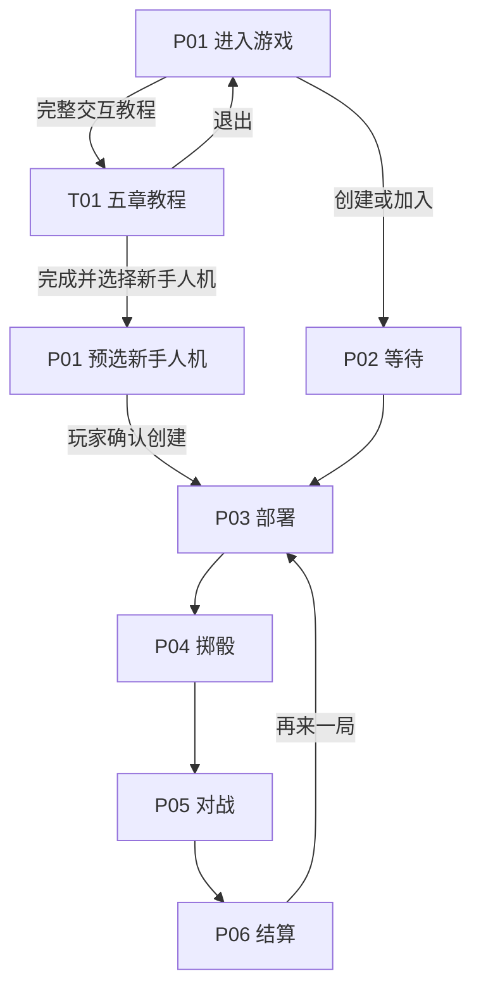

# 《海战 OCEAN》页面与对局状态流程设计 v2.1

> 对应产品：Ocean-v1.3  
> 唯一规则依据：rule-v1.8  
> 完整基线：page-flow-v2.0  
> 本版变更：T01 本地交互教程、P01 三档人机难度选择

## 1. 当前流程边界

page-flow-v2.1 完整继承 v2.0 的 P01～P06、O01～O06、10×10 / 12×12 / 15×15、1v1 联机、1v1 人机、三人一次同步行动、断线重连、终局鱼雷、声音和手机端流程。本版只新增教程支线和人机难度选择，不修改 rule-v1.8 的战斗结算。

明确不设计：快速对战队列、新的邀请链接系统、标准/自定义规则分流、三人人机。

## 2. 页面清单

| 编号 | 页面 | 状态来源 | 主要作用 |
| --- | --- | --- | --- |
| P01 | 进入游戏页 | 本机＋连接状态 | 昵称、模式、三档人机难度、地图、创建/加入、教程入口 |
| P02 | 房间等待页 | 服务器 WAITING | 房间码、席位、离开 |
| P03 | 舰队部署页 | 服务器 DEPLOYING | 手动/随机部署、准备 |
| P04 | 掷骰决定先手页 | 服务器 ROLLING | 主动掷骰、同点重投 |
| P05 | 对战页 | 服务器 PLAYING / FINAL_SALVO | 地图、行动、记录、终局鱼雷 |
| P06 | 对局结算页 | 服务器 FINISHED | 胜负、复盘、再来一局、离开 |
| T01 | 完整交互教程 | 浏览器本地状态 | 五章模拟训练，无服务器对局写入 |
| O01～O06 | 原覆盖层 | 本机＋服务器 | 规则、暂停、确认、播报、关闭、声音 |

## 3. 总体导航

T01 不进入房间状态轴，不能跳转到 P02～P06。教程完成页只修改 P01 的待选项，创建房间仍需玩家主动点击。

## 4. P01 新增人机难度

1. 只有选择“人机 1v1”时显示难度控件；1v1 联机和 3 人自由战不显示且不提交难度。
2. 难度为三个互斥原生按钮：新手、标准、专家；默认标准。
3. 每项同时显示短说明：新手偏随机、标准利用公开命中与侦察、专家分析热区与资源。
4. 难度和地图都是创建人机房的配置；房间创建后锁定，加入、恢复、部署和对局页面只读显示。
5. 人机房头部显示“地图尺寸 · 难度 AI”，让玩家能在部署和战斗前确认选择。
6. 服务器拒绝未知难度；旧客户端省略字段时按标准档处理。

## 5. T01 教程状态流

教程状态包含：当前章节、章节内部步骤、完成章节 ID、模拟数据和即时消息。五章顺序为：

1. 秘密部署；
2. 攻击与受击格；
3. 雷达、探测与私人标记；
4. 隐藏武器与分角色播报；
5. 指挥考核。

每个教学动作经过纯本地状态机验证：

- 正确动作更新模拟地图、生命值、覆盖区域或题目，并在达到章节成功条件时写入完成 ID；
- 错误动作保留当前步骤并显示具体纠正；
- “下一章”只在当前章完成后开放；“上一章”和章节导航允许复习；
- 切换章节会重置该章的瞬时演示状态，但保留完成记录；
- 全部完成后显示 100% 和新手人机入口。

完整任务、文案和验收见 `tutorial-design-v1.3.md`。

## 6. 教程与真实对局隔离

- T01 的 12×12 地图为教学画布，不使用 `room:state`，也不发送 Socket 事件。
- 进入教程前不要求服务器在线；教程内的“攻击”不会产生服务器日志、统计或房间。
- 若当前已在真实房间，不在主对局页提供教程跳转，避免覆盖房间上下文；规则层入口只在没有房间时用于进入教程。
- 教程退出后恢复 P01 原地图选项；完成按钮可有意改为“人机、新手、12×12”。
- 正式对局始终以服务器状态为权威；教程状态绝不能被行动提交逻辑读取。

## 7. 人机生命周期

1. 玩家在 P01 选择难度并创建 `bot_duel` 房。
2. 服务器自动加入对应昵称的机器人、随机合法部署并准备，真人直接进入 P03。
3. P04、P05、FINAL_SALVO 的机器人动作都读取房间锁定难度。
4. 机器人仍使用正常延迟与锁定提示，不在客户端生成决策。
5. 真人断线、恢复、投降、离开和赛后流程沿用 v2.0。
6. 真人申请再来一局时机器人自动确认；地图和难度不变，双方重新部署。

## 8. 信息边界

- 三档机器人都只接收机器人本人可见的安全 `room:state`，与真人信息边界一致。
- 教程中同时展示“攻击方消息”和“防守方消息”时，必须标为教学对照，不代表真实攻击方能看到防守方内容。
- 潜射导弹、核弹、震爆弹在真实对局继续不向攻击方报告命中或生效。
- 新增 `botDifficulty` 不包含策略内部评分、敌方情报或随机种子。

## 9. 响应式与可访问性

- P01 难度控件桌面三列，窄屏保持清晰点击区并允许适配换行。
- T01 桌面使用“地图＋概念卡”双列；手机改为单列，地图可横向滚动，触控格不小于 42px。
- 教程进度、正确/错误和地图状态均不能只靠颜色表达。
- 所有按钮提供键盘操作、禁用状态和焦点样式；即时消息使用状态区域播报。
- 教程底部导航适配 `safe-area-inset-bottom`。

## 10. 回归边界

page-flow-v2.0 中以下内容全部不变：

- 10×10、12×12、15×15 三档参数，包括驱逐舰Ⅰ 9×5 / 11×7 / 13×9 与驱逐舰Ⅱ 8×6 / 10×8 / 12×10；
- 五类本机私人标记、右键和手机长按删除；
- 三人一次行动同时作用另两方，行动方成本只算一次；
- 三人 0.85、15×15 0.9、三人 15×15 0.765 显示缩放；
- 战况 / 私人情报 / 系统记录、角色信息隔离、O04 小播报；
- 断线暂停、超时、重连、赛后退出和最终鱼雷。
